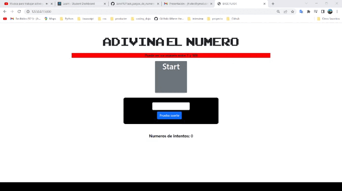

#   Flask: Adivina el numero

## Contenido

    Projecto flask que simula un juego, donde tienes que adivinar el
    numero del 1 al 100, tienes 5 intentos antes de perder el juego,
    encuentralo antes que te domine a ti. 

  

## **Instalacion y configuracion**

#### Instalar un entorno virtual con  pipenv en forma global (omitir si ya está instalado):      
#### Window:
    pip install pipenv

#### Mac:
    pip3 install pipenv

#### Clona el repositorio del proyecto: 

    $ git clone https://github.com/JairoFR/Flask_juegos_de_numeros.git
    $ cd Flask_juegos_de_numeros

####  Instala desde Pipfile los paquetes que vienen configurados: 
    $ pipenv install

####  Activa el shell de Pipenv:
    $ pipenv shell

####  Detiene  el ambiente virtual en la terminal:
    $ exit

### Abrir proyecto en un editor de codigo fuente

    1.- Abrir proyecto en visual studio code.
    2.- Ir a Python: select interpreter ctrl+shift+p.
    3.- Seleccionar el ambiente virtual creado con el nombre de la carpeta.
    4.- Abrir nueva terminal y escribir python server.py

